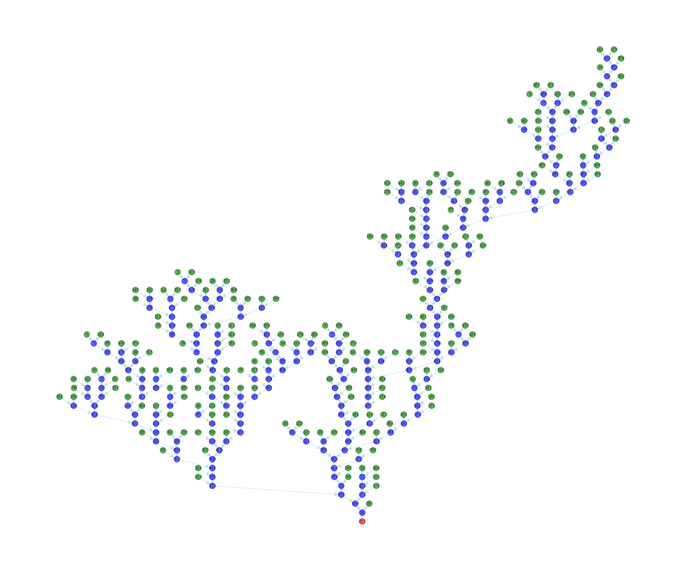

# Skeleton Analysis

## Overview

The **Skeleton Analysis** package provides tools to process spatial graphs exported from Amira. It allows for the correction of collapsed vessels, extraction of topological metrics, and visualization of the processed networks.



## Features

The package enables:

- **Correction of collapsed vessels** in spatial graphs
- **Extraction of vascular and network metrics**, including:
  - Topological Generation
  - Strahler Order
  - K-means Cluster Order
  - Tortuosity
  - Mean Radius
  - Murray’s Law
  - Branching Angle (between child vessels and parent-child connections)
  - Intervessel Length-Diameter Ratio
  - Branching Ratio
- **Visualization** of computed metrics in Amira
- **Graph merging** for combined analysis of multiple spatial graphs
- **Detection and correction of bad edges**
- **Outlier correction** for accurate metric computation

## Installation

```sh
# Clone the repository from GitLab
git clone https://github.com/JosephBrunet/skeleton-analysis.git
cd skeleton-analysis

# Install skeleton-analysis
pip install .
```

⚠️ **Warning:** To avoid dependency conflicts, it's recommended to use a virtual environment

## Usage

### Step 1: Prepare Input Files

- Export your Amira spatial graph as an ASCII file.
- Identify the root node IDs using Amira.
- Save the spatial graph in `.am` format.

### Step 2: Run the Ordering Script

```python
from skeleton_analysis import run_ordering

input_file = "path/to/spatial_graph.am"
output_file = "path/to/output_graph.am"
run_ordering(input_file, output_file)
```

This process corrects the spatial graph and computes the **Strahler Order** and **Topological Generation**.

....


## Contributing

Contributions are welcome! To contribute:

1. **Clone the repository** from GitHub.
   ```sh
   git clone https://github.com/JosephBrunet/skeleton-analysis.git
   ```
2. **Create a feature branch:**
   ```sh
   git checkout -b feature-branch
   ```
3. **Commit your changes:**
   ```sh
   git commit -m "Add new feature"
   ```
4. **Push to GitHub:**
   ```sh
   git push origin feature-branch
   ```
5. **Create a Pull Request (PR)!** 🎉

---

## Issues & Support

If you encounter any issues or have feature requests, please open an issue on GitLab.

## License

This project is licensed under the **MIT License**.

## Contact

For questions or support, feel free to reach out to:

- **Claire Walsh** – [c.walsh.11@ucl.ac.uk](mailto:c.walsh.11@ucl.ac.uk)
- **Joseph Brunet** – [j.brunet@ucl.ac.uk](mailto:j.brunet@ucl.ac.uk)

Thank you for using **skeleton-analysis**! --🚌
